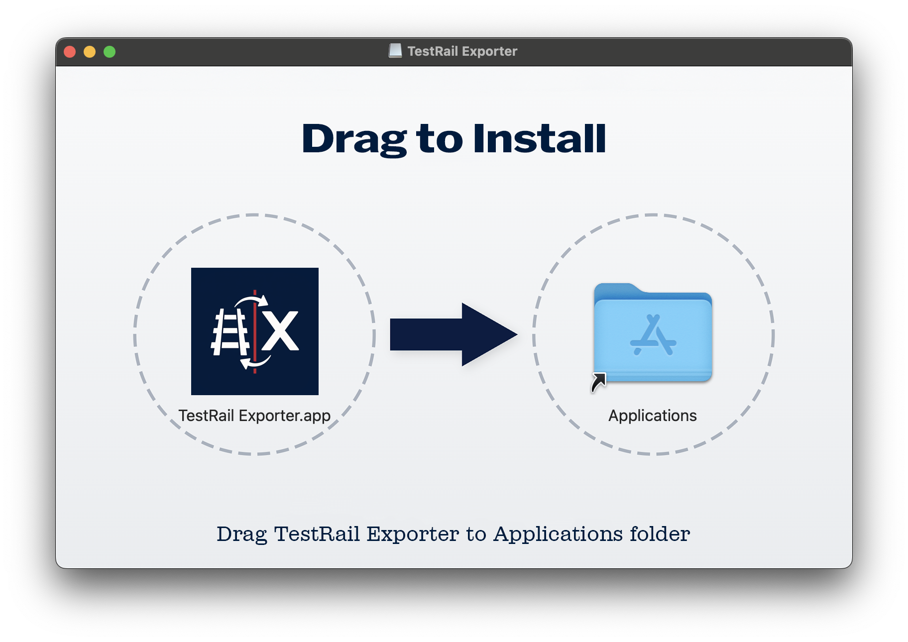
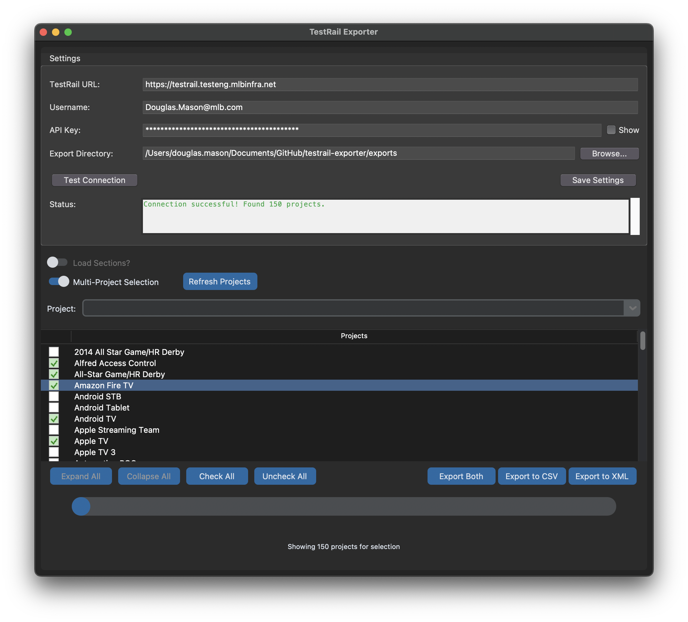
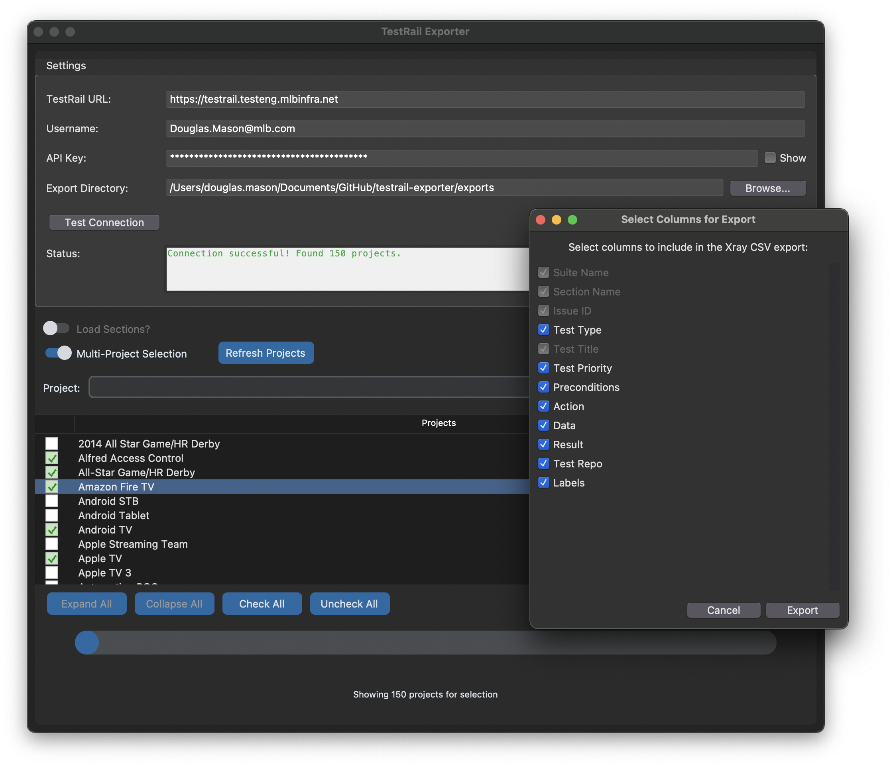

<div align="center">
  
  
  # TestRail Exporter
  
  A Python GUI application to export test cases from TestRail for later importing into X-ray.
</div>

## Quick Installation (macOS)

Download the latest release and drag TestRail Exporter to your Applications folder:



1. Download the latest `.dmg` file from the [Releases](https://github.com/dmason-mlb/testrail-exporter/releases) page
2. Open the downloaded DMG file
3. Drag TestRail Exporter to your Applications folder
4. Launch TestRail Exporter from your Applications folder

## Features

- Connect to TestRail instance with URL, username, and API key
- Browse projects, test suites, and sections
- Select test suites and sections to export
- Select specific test case fields to include in CSV exports
- Multi-project selection for cross-project exports
- Export test cases to JSON, XML, or Xray-compatible CSV format
- Configurable export directory
- Persistent settings between sessions
- Progress tracking during API operations with percentage completion
- Status messages showing current operation (e.g., "Exporting Suite Name", "Converting to CSV")
- Auto-loading of projects on startup when settings are configured
- Data caching for improved performance
- Toggle to control section loading for better performance
- Export logs saved in dedicated logs directory

## Environment Setup

### Prerequisites

- Python 3.6 or higher
- pip (Python package manager)
- Access to a TestRail instance with API permissions
- TestRail API key (generated in TestRail under My Settings > API Keys)
- Tkinter and Tcl/Tk 8.6.x (Python's GUI toolkit)

### Environment Variables (Optional)

The application can use the following environment variables for testing:

```bash
export TESTRAIL_URL="https://testrail.testeng.mlbinfra.net"
export TESTRAIL_USER="your_username"
export TESTRAIL_KEY="your_api_key"
```

Note: While environment variables can be used for testing, the application itself uses the settings configured in the GUI.

## Installation

1. Clone this repository:
   ```bash
   git clone https://github.com/your-username/testrail-exporter.git
   cd testrail-exporter
   ```

2. Install the required dependencies:
   ```bash
   pip install -r requirements.txt
   ```

3. For development installation:
   ```bash
   pip install -e .
   ```

> **Note for macOS users**: 
> If you're using pyenv or Homebrew Python on macOS, you might encounter Tcl/Tk compatibility issues.
> Please see [INSTALL_MACOS.md](INSTALL_MACOS.md) for detailed instructions on resolving these issues.

## Application Configuration

### TestRail Connection

The application requires the following configuration to connect to TestRail:

1. **TestRail URL**: The URL of your TestRail instance
   - Default: `https://testrail.testeng.mlbinfra.net`

2. **Username**: Your TestRail username

3. **API Key**: Your TestRail API key
   - Can be generated in TestRail under My Settings > API Keys

4. **Export Directory**: The directory where exported files will be saved
   - Default: `~/Documents`

### Configuration Testing

Use the "Test Connection" button to verify your credentials before loading projects.

## Usage

1. Run the application using one of these methods:
   ```bash
   # Method 1: Run directly
   python testrail_exporter/main.py
   
   # Method 2: If installed with pip install -e .
   testrail-exporter
   ```

2. Configure TestRail connection:
   - Enter your TestRail URL (default: https://testrail.testeng.mlbinfra.net)
   - Enter your TestRail username
   - Enter your TestRail API key
   - Configure export directory

3. Click "Test Connection" to verify your credentials

4. Click "Load Projects" to load projects from TestRail

5. Select one or more projects from the dropdown (multi-select supported)
   

6. Browse and select test suites and sections:
   - Use the tree view to navigate the project structure
   - Toggle "Load Sections?" to control whether sections are loaded (improves performance for large projects)
   - Check the checkboxes next to suites or sections to select them
   - Parent checkboxes show a partial fill when some children are selected
   - Use "Expand All" and "Collapse All" to navigate more easily (available when sections are loaded)
   - Use "Check All" and "Uncheck All" for quick selection
   - Progress bar shows percentage completion during API operations
   - Status messages indicate current operation (e.g., "Loading Applause Regression Suite")

7. Choose export format:
   - Click "Export JSON" to export in JSON format
   - Click "Export XML" to export in TestRail-compatible XML format
   - Click "Export to Xray CSV" to export both XML and Xray-compatible CSV files
   - (Optional) Click "Select CSV Fields" to choose which test case fields will be included in the generated CSV
     
   - Files are automatically saved with timestamps to prevent conflicts
   - Export logs are saved in a "logs" subdirectory within your export directory
   - Wait for the export process to complete (progress bar shows percentage completion)
   - Status messages show current operation during export
   - A success message will appear when the export is finished showing "100%" and "Tasks Complete"


## Export Formats

### JSON Format

The exported JSON file contains:

- Project information (id, name)
- Test cases with:
  - Standard fields (id, title, suite_name, section_name, etc.)
  - Human-readable names instead of IDs (suite_name, section_name, priority_name, type_name)
  - Custom fields (prefixed with `custom_`)

Example:
```json
{
  "project": {
    "id": 123,
    "name": "Example Project"
  },
  "cases": [
    {
      "id": 456,
      "title": "Test Case Title",
      "suite_name": "Test Suite Name",
      "section_name": "Test Section Name",
      "priority_name": "High",
      "type_name": "Functional",
      "custom_steps": "Step 1...",
      "custom_expected": "Expected result..."
    }
  ]
}
```

### Xray CSV Format

The "Export to Xray CSV" function creates two files:

1. **XML file** (for reference): TestRail-compatible XML structure
2. **CSV file** (for Xray import): Xray-compatible CSV format with the following structure:
   - Issue ID, Issue Key, Test Type, Test Summary, Test Priority, Action, Data, Result, Test Repo, Labels
   - Handles both single suite and multiple suite exports
   - Converts TestRail test cases to Xray-compatible format
   - Processes test steps and expected results appropriately
   - Uses hierarchical test repository names for organization

The CSV file is specifically formatted for importing into Atlassian Xray and includes:
- Proper priority mapping (Critical=1, High=2, Medium=3, Low=4)
- Test type conversion (Manual, Exploratory, Automated→Generic)
- Section hierarchy reflected in Test Repo field
- Clean HTML tag removal from test content

### XML Format

The exported XML file contains TestRail-compatible XML structure:

- Hierarchical structure with suites, sections, and cases
- Test cases with complete metadata including custom fields
- Compatible with TestRail's XML import format
- Human-readable names for types, priorities, and other fields

Example structure:
```xml
<suite>
  <id>S123</id>
  <name>Test Suite</name>
  <description/>
  <sections>
    <section>
      <name>Test Cases</name>
      <description/>
      <cases>
        <case>
          <id>C456</id>
          <title>Test Case Title</title>
          <template>Test Case</template>
          <type>Functional</type>
          <priority>High</priority>
          <estimate/>
          <references/>
          <custom>
            <preconds>Preconditions...</preconds>
            <steps>Test steps...</steps>
            <expected>Expected result...</expected>
          </custom>
        </case>
      </cases>
    </section>
  </sections>
</suite>
```

## Troubleshooting

### Common Issues

1. **Connection Failures**:
   - Verify your TestRail URL is correct and accessible
   - Check your username and API key
   - Ensure your TestRail user has API access permissions

2. **No Projects Shown**:
   - Verify your user has access to projects in TestRail

3. **Export Errors**:
   - Check your network connection
   - Verify you have write permissions to the export directory

4. **Installation Issues**:
   - If you encounter module not found errors, make sure the package name in imports uses underscores (`testrail_exporter`) not hyphens
   - If you encounter Tkinter/Tcl/Tk errors on macOS, refer to [INSTALL_MACOS.md](INSTALL_MACOS.md)

### Logging

- Export operations create detailed log files in a "logs" subdirectory within your export directory
- Log files are timestamped for easy identification
- Logs include all API operations, errors, and export progress
- Console output shows real-time status during operations

## Development

The project is structured as follows:

- `api/`: TestRail API client
- `gui/`: User interface components
- `models/`: Data models for TestRail entities
- `utils/`: Utility functions including export functionality

## License

[MIT License](LICENSE)