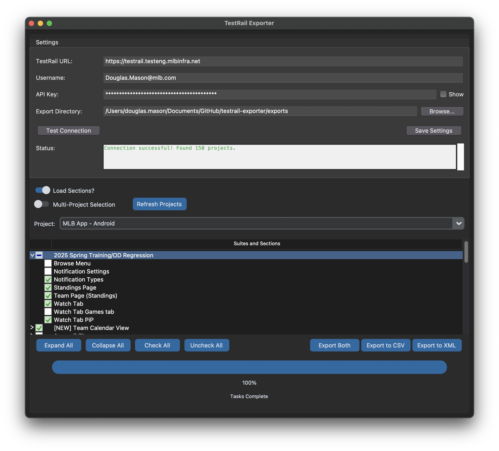

# TestRail Exporter

> **⚠️ DISCLAIMER: This application is currently under active development and may contain bugs. While it is partially functional, use with caution and please report any issues you encounter. This disclaimer will be removed once the application reaches a more stable state.**

A Python GUI application to export test cases from TestRail for later importing into X-ray.



## Features

- Connect to TestRail instance with URL, username, and API key
- Browse projects, test suites, and sections
- Select test suites and sections to export
- Export test cases to JSON or CSV format
- Configurable export directory
- Persistent settings between sessions
- Progress tracking during API operations

## Environment Setup

### Prerequisites

- Python 3.6 or higher
- pip (Python package manager)
- Access to a TestRail instance with API permissions
- TestRail API key (generated in TestRail under My Settings > API Keys)
- Tkinter and Tcl/Tk 8.6.x (Python's GUI toolkit)

### Environment Variables (Optional)

The application can use the following environment variables for testing:

```bash
export TESTRAIL_URL="https://testrail.testeng.mlbinfra.net"
export TESTRAIL_USER="your_username"
export TESTRAIL_KEY="your_api_key"
```

Note: While environment variables can be used for testing, the application itself uses the settings configured in the GUI.

## Installation

1. Clone this repository:
   ```bash
   git clone https://github.com/your-username/testrail-exporter.git
   cd testrail-exporter
   ```

2. Install the required dependencies:
   ```bash
   pip install -r requirements.txt
   ```

3. For development installation:
   ```bash
   pip install -e .
   ```

> **Note for macOS users**: 
> If you're using pyenv or Homebrew Python on macOS, you might encounter Tcl/Tk compatibility issues.
> Please see [INSTALL_MACOS.md](INSTALL_MACOS.md) for detailed instructions on resolving these issues.

## Application Configuration

### TestRail Connection

The application requires the following configuration to connect to TestRail:

1. **TestRail URL**: The URL of your TestRail instance
   - Default: `https://testrail.testeng.mlbinfra.net`

2. **Username**: Your TestRail username

3. **API Key**: Your TestRail API key
   - Can be generated in TestRail under My Settings > API Keys

4. **Export Directory**: The directory where exported files will be saved
   - Default: `~/Documents`

### Configuration Testing

Use the "Test Connection" button to verify your credentials before loading projects.

## Usage

1. Run the application using one of these methods:
   ```bash
   # Method 1: Run directly
   python testrail_exporter/main.py
   
   # Method 2: If installed with pip install -e .
   testrail-exporter
   ```

2. Configure TestRail connection:
   - Enter your TestRail URL (default: https://testrail.testeng.mlbinfra.net)
   - Enter your TestRail username
   - Enter your TestRail API key
   - Configure export directory

3. Click "Test Connection" to verify your credentials

4. Click "Load Projects" to load projects from TestRail

5. Select a project from the dropdown

6. Browse and select test suites and sections:
   - Use the tree view to navigate the project structure
   - Check the checkboxes next to suites or sections to select them
   - Parent checkboxes show a partial fill when some children are selected
   - Use "Expand All" and "Collapse All" to navigate more easily
   - Use "Check All" and "Uncheck All" for quick selection

7. Choose export format:
   - Click "Export JSON" to export in JSON format
   - Click "Export CSV" to export in CSV format compatible with spreadsheet software
   - Choose a filename and location in the save dialog
   - Wait for the export process to complete (progress is shown at the bottom)
   - A success message will appear when the export is finished


## Export Formats

### JSON Format

The exported JSON file contains:

- Project information (id, name)
- Test cases with:
  - Standard fields (id, title, section_id, etc.)
  - Custom fields (prefixed with `custom_`)

Example:
```json
{
  "project": {
    "id": 123,
    "name": "Example Project"
  },
  "cases": [
    {
      "id": 456,
      "title": "Test Case Title",
      "section_id": 789,
      "suite_id": 101,
      "custom_steps": "Step 1...",
      "custom_expected": "Expected result..."
    }
  ]
}
```

### CSV Format

The exported CSV file contains all test case fields as columns:

- Each test case is represented as a row
- Standard fields (id, title, section_id, etc.) are included
- Custom fields (prefixed with `custom_`) are included as separate columns
- All fields found in any case are included in the CSV headers

CSV files can be easily:
- Opened in spreadsheet applications like Excel or Google Sheets
- Imported into test management tools
- Used for data analysis or reporting

## Troubleshooting

### Common Issues

1. **Connection Failures**:
   - Verify your TestRail URL is correct and accessible
   - Check your username and API key
   - Ensure your TestRail user has API access permissions

2. **No Projects Shown**:
   - Verify your user has access to projects in TestRail

3. **Export Errors**:
   - Check your network connection
   - Verify you have write permissions to the export directory

4. **Installation Issues**:
   - If you encounter module not found errors, make sure the package name in imports uses underscores (`testrail_exporter`) not hyphens
   - If you encounter Tkinter/Tcl/Tk errors on macOS, refer to [INSTALL_MACOS.md](INSTALL_MACOS.md)

### Logging

The application logs errors to the console during operation.

## Development

The project is structured as follows:

- `api/`: TestRail API client
- `gui/`: User interface components
- `models/`: Data models for TestRail entities
- `utils/`: Utility functions including export functionality

### Documentation

Additional documentation:
- `QUICKSTART.md`: Getting started guide
- `API_ENDPOINTS.md`: Details on TestRail API usage
- `TESTING.md`: Testing procedures
- `ROADMAP.md`: Future development plans
- `INSTALL_MACOS.md`: macOS-specific installation guide

## Future Enhancements

- Enhanced CSV export with X-ray-specific field mappings
- Filter test cases by additional criteria
- Search functionality for finding specific suites/sections
- Batch export multiple projects
- Test case attachment handling
- Dark mode support
- Keyboard shortcuts for common operations

## License

[MIT License](LICENSE)